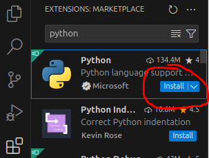
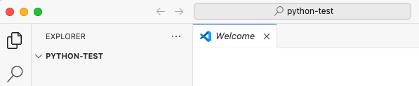
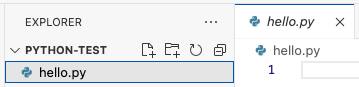
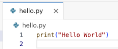
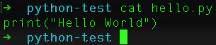

{}
You are getting the first edition of all these pages. Please let me know if you find an error!
{}

This lab is for those who are installing Visual Studio Code on Mac machines.

## Installation
Instructions in this section are taken from https://code.visualstudio.com/docs/setup/mac.

1. Download [Visual Studio Code for macOS](https://go.microsoft.com/fwlink/?LinkID=534106).
1. Open the browser's download list and locate the downloaded app or archive.
2. If archive, extract the archive contents. Use double-click for some browsers or select the 'magnifying glass' icon with Safari.
3. Drag `Visual Studio Code.app` to the **Applications** folder, making it available in the macOS Launchpad.
1. Open VS Code from the **Applications folder** by double clicking the icon.
1. Add VS Code to your Dock by right-clicking on the icon, located in the Dock, to bring up the context menu and choosing Options, Keep in Dock.

### Enable launching VSCode from the CLI
You can also run VS Code from the terminal by typing `code` after adding it to the path:

   - Launch VS Code.
   - Open the **Command Palette** (Cmd+Shift+P) and type 'shell command' to find the **Shell Command: Install 'code' command in PATH** command. Select this.
   
   - You will need to restart any open Terminal windows for the change to take effect. You'll be able to type `code .` in any folder to start editing files in that folder.

### Configuring VSCode for Python

1. Click on the Extensions button in the far left sidebar  or press Ctrl+Shift+X.
2. Type `python` in the search box under `EXTENSIONS: MARKETPLACE`. The top result should be Python from Microsoft. Click the Install button:

   

You should now be good to go to develop Python code with VSCode on Mac.

## Test drive

We are going to create a sample project directory in the Terminal, then open VSCode and edit files in that directory.

### Launching VSCode from the Terminal
1. Start a Terminal in Ubuntu. Hit the Windows key and start typing `terminal`. Select the Terminal app.
   - You may also want to right-click the Terminal and "Pin to Dash" for easy startup!
2. Run the following in the Ubuntu terminal:
   
cd       # make sure in your home directory
mkdir python-test  # make a directory to play in
cd python-test     # change to the new directory
code .   # launch VSCode in the current directory

   The `code` command launches the VSCode program. It was added when we installed the WSL extension. The command `code .` says launch code and have it open the current *working directory*. The symbol `.` always means the working directory. Sometimes it will be necessary to explicitly tell the CLI we are referring to the working directory; more on those situations as they arise.
   
1. A VSCode window will open after a moment.
2. You may be asked if you "trust the authors of the files in this folder". Click the checkbox and then pick "Yes, I trust the authors."
3. You should see something like the following when complete. 

   
   
   The pane on the left is the Explorer pane. This is showing the directory `python-test`. There are not yet any files in the directory.

### Creating a new file
Let's create a file in the Terminal in our project directory. We should see it immediately in VSCode.

1. Go back to your Terminal and make sure you are in the `python-test` directory. 
2. Type the command `touch hello.py` to create an empty Python file.
3. Go back to VSCode. You should see the file `hello.py` in the directory here. Click on it and it will open an empty editor pane.
   
      
4. In the code editor, type `print("Hello World")`. Hit CTRL+S to save the file. **You must explicitly save your changes in VSCode.**
   
   
5. Go back to the Terminal and type `cat hello.py`. You should see the code.
   
   

So you now have VSCode successfully editing files and interacting with directories inside Ubuntu. 

You are now ready to code! Move on to [04. VSCode basics lab](../../vscode-basics/).
