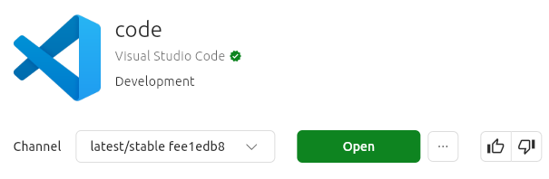
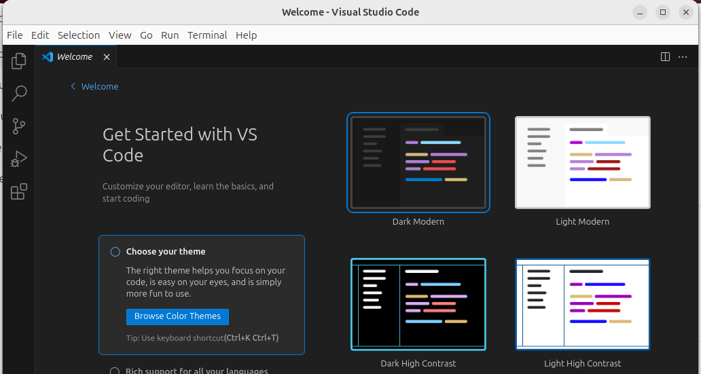
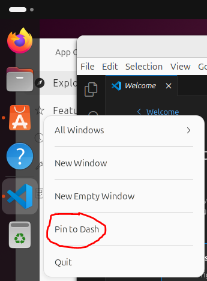
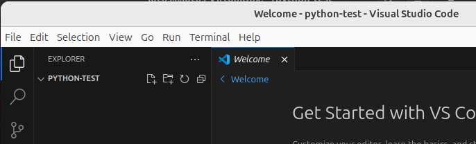
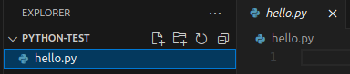
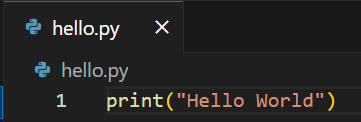
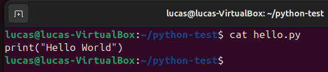

{}
You are getting the first edition of all these pages. Please let me know if you find an error!
{}

This lab is for those who are on Windows and are running Ubuntu inside VirtualBox [using Option 2 for Windows from this lab](/labs/getting-linux//#option-2---virtualbox).

## Installation

1. Open VirtualBox and start up your Ubuntu virtual machine (VM). Sign in to Ubuntu. 
   - You may want to go full screen. Do this by selecting View -> Full Screen. 
   - If the Full Screen is small, right-click on the Desktop -> Display Settings then change the Resolution to something larger, probably 1920x1080.
   - You exit full screen by hitting `Right CTRL+F`
2. In Ubuntu, click the "App Center" icon in the left app bar. 
   
   
1. Type `visual studio code` in the search bar of the App Center. Select the "code" result with the blue icon.
   
1. Click "Install" on the next screen.
2. You will be prompted to enter your Ubuntu login password. VSCode will now take a few moments to install.
3. You should see a green "Open" button when the installation finishes. Click "Open".
   
1. VSCode will open and you will see a screen similar to this:
   
1. On the far left side of Ubuntu in the app bar (called Dash), you will now see the VSCode icon. Right-click it and select "Pin to Dash" to make it easy to launch VSCode from the Ubuntu desktop.
      

### Configuring VSCode for Python

1. Click on the Extensions button in the far left sidebar  or press Ctrl+Shift+X.
2. Type `python` in the search box under `EXTENSIONS: MARKETPLACE`. The top result should be Python from Microsoft. Click the Install button:

   

You should now be good to go to develop Python code in Ubuntu.

## Test drive

We are going to create a sample project directory in Ubuntu on the WSL, then open VSCode and edit files in that Linux directory.

### Launching VSCode from the Terminal
1. Start a Terminal in Ubuntu. Hit the Windows key and start typing `terminal`. Select the Terminal app.
   - You may also want to right-click the Terminal and "Pin to Dash" for easy startup!
2. Run the following in the Ubuntu terminal:
   
cd       # make sure in your home directory
mkdir python-test  # make a directory to play in
cd python-test     # change to the new directory
code .   # launch VSCode in the current directory

   The `code` command launches the VSCode program. It was added when we installed the WSL extension. The command `code .` says launch code and have it open the current *working directory*. The symbol `.` always means the working directory. Sometimes it will be necessary to explicitly tell the CLI we are referring to the working directory; more on those situations as they arise.
   
1. A VSCode window will open after a moment.
2. You may be asked if you "trust the authors of the files in this folder". Click the checkbox and then pick "Yes, I trust the authors."
3. You should see something like the following when complete. 

   
   
   The pane on the left is the Explorer pane. This is showing the directory `python-test`. There are not yet any files in the directory.

### Creating a new file
Let's create a file in the Terminal in our project directory. We should see it immediately in VSCode.

1. Go back to your Ubuntu terminal and make sure you are in the `python-test` directory. 
2. Type the command `touch hello.py` to create an empty Python file.
3. Go back to VSCode. You should see the file `hello.py` in the directory here. Click on it and it will open an empty editor pane.
      
4. In the code editor, type `print("Hello World")`. Hit CTRL+S to save the file. **You must explicitly save your changes in VSCode.**
   
5. Go back to the Ubuntu Terminal and type `cat hello.py`. You should see the code.
   

So you now have VSCode successfully editing files and interacting with directories inside Ubuntu. 

You are now ready to code! Move on to [04. VSCode basics lab](../../vscode-basics/).
