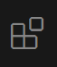
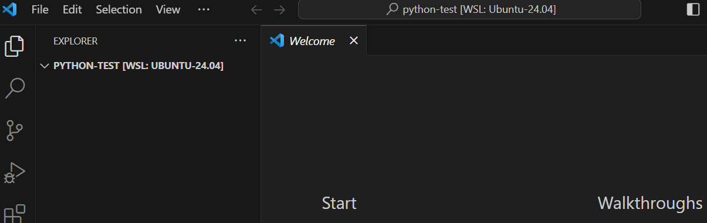
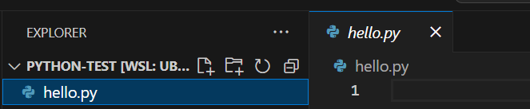
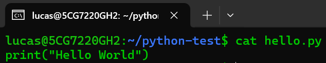

{}
You are getting the first edition of all these pages. Please let me know if you find an error!
{}

This lab is for those who are on Windows and have set up the Windows Subsystem for Linux (WSL) [using Option 1 for Windows from this lab](/labs/getting-linux/#option-1-preferred---windows-subsystem-for-linux).

## Installation

1. Install [Visual Studio Code](https://code.visualstudio.com/) on the ***Windows*** side (not in WSL).
   - When prompted to **Select Additional Tasks** during installation, be sure to check the **Add to PATH** option so you can easily open a folder in WSL using the `code` command. `code` will launch VSCode from the CLI.
1. Run VSCode from the Windows side after installation is complete.
2. Click on the Extensions button in the far left sidebar  or press Ctrl+Shift+X.
3. Type WSL in the search box under `EXTENSIONS: MARKETPLACE`. The top result should be WSL from Microsoft. Click the install button:

   
4. Also search for Python in the Extensions marketplace and install it. The one you want is also from Microsoft.

With the WSL extension, if we open a directory in Ubuntu with Python files, VSCode will use the tools installed in Ubuntu when working with files inside Ubuntu. When working with files in Windows, VSCode will use programs installed on the Windows side.

You should now be good to go to develop Python code that lives in Linux from VSCode.

## Test drive

We are going to create a sample project directory in Ubuntu on the WSL, then open VSCode and edit files in that Linux directory.

### Launching VSCode from Ubuntu
1. Start Ubuntu from Windows by selecting Ubuntu from the Windows run menu, or by opening an Ubuntu terminal.
2. Run the following in the Ubuntu terminal:
   
cd       # make sure in your home directory
mkdir python-test  # make a directory to play in
cd python-test     # change to the new directory
code .   # launch VSCode in the current directory

   The `code` command launches the VSCode program. It was added when we installed the WSL extension. The command `code .` says launch code and have it open the current *working directory*. The symbol `.` always means the working directory. Sometimes it will be necessary to explicitly tell the CLI we are referring to the working directory; more on those situations as they arise.
   
1. You will see a download take place. A new VSCode window will open after a moment on the Windows side.
1. You may be asked if you "trust the authors of the files in this folder". Click the checkbox and then pick "Yes, I trust the authors."
2. You should see something like the following when complete. 

   
   
   The pane on the left is the Explorer pane. This is showing the directory `python-test`. There are not yet any files in the directory.

### Creating a new file
Let's create a file on the Ubuntu side in our project directory. We should see it immediately in VSCode.

1. Go back to your Ubuntu terminal and make sure you are in the `python-test` directory. 
2. Type the command `touch hello.py` to create an empty Python file.
3. Go back to VSCode. You should see the file `hello.py` in the directory here. Click on it and it will open an empty editor pane.
      
4. In the code editor, type `print("Hello World")`. Hit CTRL+S to save the file. **You must explicitly save your changes in VSCode.**
   
5. Go back to the Ubuntu Terminal and type `cat hello.py`. You should see the code.
   

So you now have VSCode on the Windows side successfully editing files and interacting with directories inside Ubuntu. 

You are now ready to code! Move on to [04. VSCode basics lab](../../vscode-basics/).
