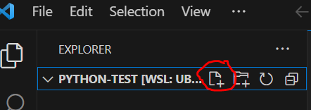

{}
You are getting the first edition of all these pages. Please let me know if you find an error!
{}

## Organizing and opening projects
The last thing we did in [Lab 03. Installing the VSCode IDE](../installing-vscode/) was to open the `python-test` directory in VSCode.

**Rule #1: Keep each project, assignment, and lab in its own directory.**
It is fine to aggregate those files under a single directory, like so:

~/seng-201
├── assignment1
├── assignment2
├── lab01
├── lab02
└── python-test
    ├── fib.py
    ├── hello.py
    └── hello2.py

This is the structure you want. I have created a `seng-201` subdirectory in my *home directory* symbolized by the `~`. Inside `seng-201`, I have created subdirectories for each project. 

**Rule #2: Open the specific project directory in VSCode, not the parent directory.** Suppose you want to work on `assignment1`, then you need to open the `assignment1` folder. You open a folder in VSCode in two ways:
1. Use your Terminal/CLI to `cd` into the project folder, then type `code .`
2. Open VSCode first, then do `File > Open Folder` and descend *inside* the project folder, then click `Open`.

The folder you open serves as the *working directory* for VSCode. If you open the parent folder `seng-201`, you can still edit project files, but you will add complexity to running the projects. Don't do it.

## Explorer pane
The Explorer pane is where you browse and manage files. Open it by clicking on the Explorer icon on the main left sidebar: 


Things you can do in the Explorer:
- Create new files and subdirectories.
- Double-click files to open.
- Right click files and directories for a variety of tools, like renaming and deleting. 

### Exercise
1. Click on the `python-test` folder name. You created this folder at the end of the [03. Installing the VSCode IDE lab](../installing-vscode/)
2. Click the New File icon. Type `hello.py` in the box and hit Enter.
   
   
3. You will see an editor tab pop open on the right with the name `hello.py` at the top. 

## Knowledge check:
- Question: (True/False) Each coding project should have its own directory on the filesystem?
- Question: (True/False) It's okay to open the parent directory holding multiple projects in VSCode?
- Question: How do you open VSCode from the current directory *from the CLI?*
