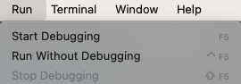
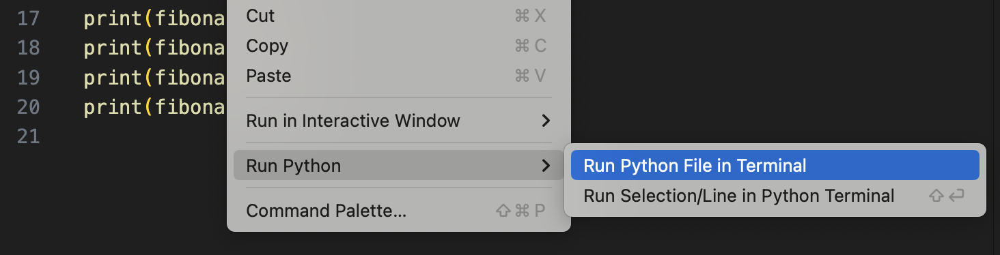

{}
You are getting the first edition of all these pages. Please let me know if you find an error!
{}

VSCode itself does not know how to run Python code or any other language. VSCode instead uses tools installed on your computer to run programs, e.g., the Python tools you downloaded from https://python.org. So if you want to use VSCode to develop, e.g., Java or Javascript programs, you need to have the necessary tools installed on your system.

VSCode will automatically find language tools on your file system if they are installed in a "standard" location.

## Running code
There are three ways to run a program file:

1. Select **the `Run` menu** at the top, then `Start Debugging`
   
   - If necessary, select the `Python Debugger` popup, and select default options of subsequent pop-ups until you see the program run in the interactive Terminal at the bottom.
   - We will discuss the difference between `Start Debugging` and `Run Without Debugging` in the future. 
2. In the editor window, `Right-click` anywhere in the code to open the **context menu**, then select `Run Python > Run Python File in Terminal`.
      
3. Press the `F5` hotkey to start debugging.
   
**By default, VSCode will run the file in the active editor.** Alternately, you can right-click a different file in the Explorer and run it.

### Exercise
1. Create `hello.py` in the `python-test` directory if needed and add `print("Hello World")`
2. Run `hello.py` using the Run menu
3. Run it using the editor context window
4. Use the `F5` key. If your `F5` key is missing or hard to work with, use Google to research "how to reassign keyboard shortcuts in VSCode". Reassigning it to the shortcut `Cmd+R` or `Ctrl+R` is a solid option.

## The Integrated Terminal
When you ran your `hello.py` program, you should have seen a flurry of output in the **Integrated Terminal** window at the bottom. What just happened?
1. VSCode opened a Terminal CLI, like you did in the [Launching a Terminal lab](../../cli-basics/launching/), except this one is embedded in VSCode.
2. VSCode issued the CLI command `python` with your file as an argument.
3. `python` runs in the Terminal and prints output.



Your Terminal contents will different, however, you should see `Hello World` in there. 

Remember, VSCode doesn't run Python code itself -- it uses the tools installed on your computer to do it.

**Important note:** The Terminal in VSCode is an embedded version of the Terminal we used in [Intro to the CLI](../../cli-basics/). You can use the same CLI commands like `cd`, `ls`, `mkdir`, etc. 

You may find it  convenient to use this integrated Terminal rather than switching to a separate windows. Or you may prefer to keep them separate. Do what works for you. 

You can always open the Terminal in VSCode by clicking the Terminal pane (highlighted red in the figure above), or by selecting the `Terminal` menu at the top.

### Exercise
1. List directory contents in the integrated Terminal using the `ls` command.
2. Type `cd ~` in the integrated Terminal to switch to your home directory. Notice how the Explorer pane ***does not change***. You are only changing the working directory in the Terminal.
3. Run `hello.py` again using VSCode. What happens in the Terminal?
4. Use the Terminal to navigate to your `python-test` directory using `cd` commands.
5. Run the command `touch hello2.py`. Does it appear in the Explorer pane?
6. Run the command `rm hello2.py`. What happened? What happened in the Explorer pane?

## Knowledge check:
- Question: What is the keyboard shortcut for debugging/running your program?
- Question: How do you open an integrated Terminal without running a Python program?
- Question: How can you print the name of the *current working directory* in the integrated Terminal?
- Question: If you have a runaway process in the integrated Terminal, how do you cancel/kill it? (The answer is the same as for the regular Terminal.)