Debugging support tools have been around since the 70s. All modern IDEs let you control the ***steps*** of program execution while showing the  program ***state***. Debugging tools, properly used, are much more efficient than `print` statements.

## Running the debugger

If you didn't do it in the [Debugging Basics lab](../debugging-basics/), create a `debugging-lab/` directory and download [bad_math.py](../debugging-basics/bad_math.py) to it.

1. Open the `debugging-lab/` directory and open `bad_math.py` in an editor.
2. Run the program in debug mode by doing one of: 
   - Hit your `F5` key.
   - Right click in the code editor and select `Debug 'bad_math'`. 
   - Click the Bug button at the top of PyCharm.
    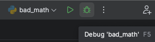
3. The first time you debug a file you will need to choose a debugger. Choose the `Python Debugger` suggested by Code.
   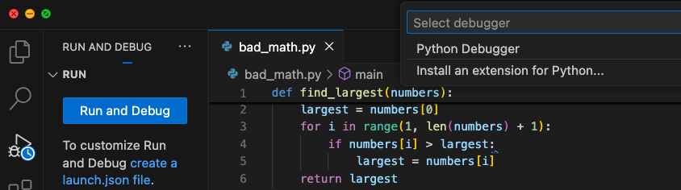
4. You will now be prompted to select a debugging configuration. Choose `Python File: Debug the currently active Python file`.
   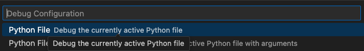

The Visual Studio Code debugger should now launch. Notice that you are now in the Debugging pane of Visual Studio Code, which is accessible anytime from the left sidebar. This pane will open any time you Run a program with debugging.

You should see something similar to the following:
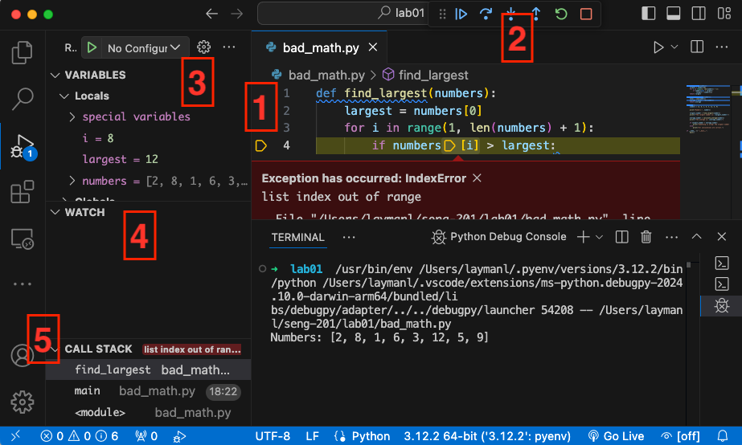
 The `bad_math.py` program should crash with an exception. Here are the essential elements you see:
1. The editor shows the exception details in a red box. The <mark>yellow line and arrow</mark> mark the ***step*** the program was on when it crashed.
2. These are the **step controls**. Visual Studio Code automatically paused on the step that caused the crash. More on the controls below.
3. The **variable pane** shows the values of all variables *in scope* at the current step. Variable values are one part of the program state.
4. The **watch pane** lets you isolate variables you want to monitor. Similar to the variable pane.
5. The **call stack** is the other part of the program state. It shows the stack of function calls that arrived at the current step.

Using the **step controls**, hit either the blue "play" icon or the red "stop" icon. Stop will cancel execution and produce nothing, play will continue execution of the program, resulting in the exception printing in the Terminal (where the program is running) and the program will crash. 

## Breakpoints and stepping
The Visual Studio Code debugger will automatically ***break*** (pause) execution on steps that throw an exception. You can look at the **variable pane** and **call stack** to understand the state of the program and hopefully gain insight into what happened.

However, you will often want to **break** execution at step of your choosing, not just when an exception happens. Maybe want to see how a value was computed and what the variables were well before the crash happened. Or maybe your program doesn't crash at all, but simply produces the wrong output.

You add ***breakpoints*** in the IDE to tell the debugger on which step(s) to pause execution. To set a breakpoint:
1. Left click in the blank space to the left of the line number in the code editor. A red dot will appear to indicate the breakpoint. Set a breakpoint on `line 3`.
   - Click the breakpoint again to remove it. 
   - You can set multiple break points. 
   - You cannot set a breakpoint on a blank line of code.
1. Run the program with Debugging from the `Run` menu or hit `F5`.
2. The debugger will ***break*** (pause execution) on `line 3` or on whichever line you placed the breakpoint.
   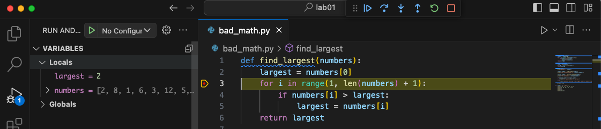
3. Use the **step controls** to control the execution of the program. All of these controls have a keyboard shortcut as well.
   - 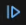 - **continue** execution until the next breakpoint or the program ends.
   - 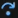 - **Step Over** the current line, which means evaluate the line and go to the next one. 
   - 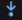 - **Step Into** the current line. Super the current line *calls a function* like `if my_fun(x) == True`, the debugger will *step into* the `my_fun()` function and step through it. If you did *step over*, the debugger would evaluate the entire line including the `my_fun()` call without pausing.
   - 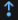 - **Step Out** of the current function. This will immediately complete all lines of the current function and pause at the line that called the current function in the **call stack**.
   - 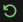 - **Restart** the debugging on the program. Just like re-running it. All your breakpoints will be retained.
   - 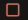 - **Stop** the debugger without further execution of the code.

<video controls autoplay playsinline muted loop>
<source src="stepping-continuing.mp4" type="video/mp4">  
</video>

Notice that the **variable pane**, **watch pane**, and **call stack** update with each step. So now, using breakpoints and the step controls, you can precisely control the execution of the program to more methodically track down what is going on.

## Adding a watch variable
The **variables pane** shows all variables *in scope* at each step. This set of variables can be overwhelming, and you often won't care about most of the variables. 

The **watch pane** lets you specify variables you want to watch specifically. To set a **watch variable**: 
1. Set a breakpoint and start debugging the program
2. Either:
   - Select the variable in the editor, then `Right Click > Add to Watch`; or
   - In the watch pane, click the + to `Add Expression` and type in the name of the variable, e.g., type the name `largest`.
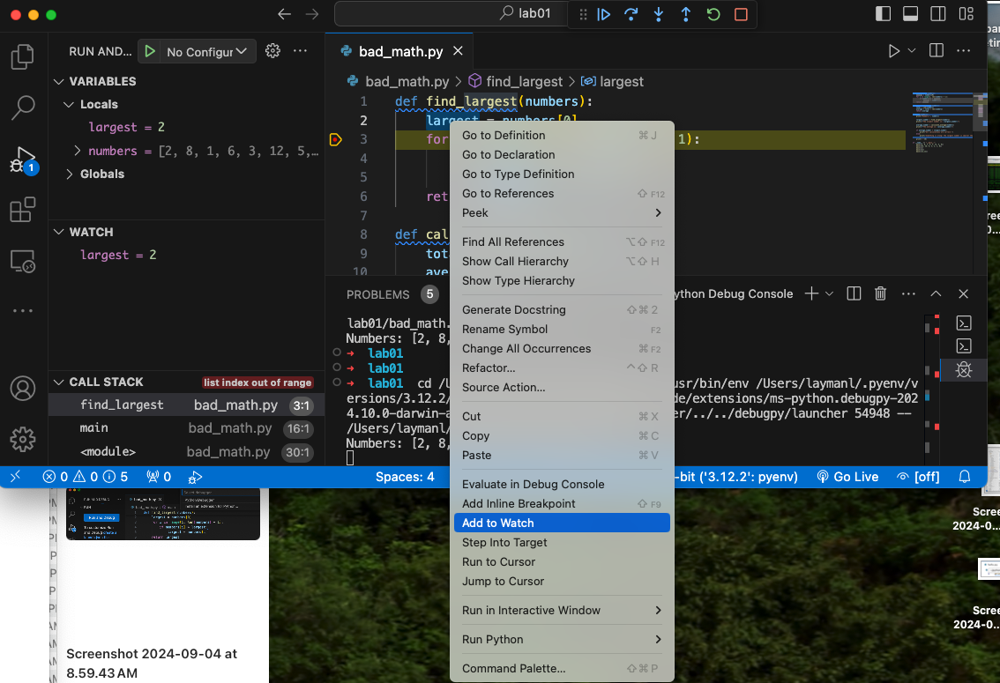

Now you will see your watched variables update as you step through the program. You can add as many watch variables as you like.

## Conditional breakpoints

Using the watch pane helps you focus on what's important as you refine your "what's going on here?" hypothesis while debugging. 

You will also find it useful to only have a breakpoint trigger under certain conditions. For example, you are reading file full of 10,000 hospital patient records and you figure out that the program crashes when it gets to the record belonging to "Alice St. John". Unfortunately, Alice is record 342. You don't want to set a breakpoint on the offending line and have to hit the Continue control 341 times to figure out what's going on with Alice's data.

Enter the ***conditional breakpoint***, which is a breakpoint that only pauses execution when an expression you specify evaluates to `True`. Try it with our `bad_math.py` sample:
1. Right click to the left of Line 3 and select `Add Conditional Breakpoint`
2. A textbox will appear with `Expression` on the left. Type `largest == 12` in the textbox.
3. Now hit the **Continue** control. The conditional breakpoint will only pause when `largest == 12`.

Conditional breakpoints are extremely useful for refining your hypothesis as to what's going on. Note you can enter any Python expression that evaluates to `True` or `False`, for example:
   - `largest == 12 and i < 8`
   - `largest >= 5`

<video controls autoplay playsinline muted loop>
<source src="conditional-bp.mp4" type="video/mp4">  
</video>

## Starting with vs. without debugging
When running your program, you have the option to `Start with Debugging` or `Start without Debugging`. What's the practical difference? 

Starting *without debugging* will not pause on breakpoints or exception, nor will variable values be tracked. Running without debugging will not affect any breakpoints or watch variables you have set -- it just doesn't update them. 

Starting *with debugging* will do everything we showed, but significantly slows down the execution time of your program.

## Exercise
There are 4 bugs present in the initial `bad_math.py` that can be triggered based on which value the `numbers` variable has. The various calls to `main()` at the bottom of the file are sufficient to reveal all the bugs. 

Find and remove them. There are multiple ways to squash the bugs. You may squash two bugs at once depending on how you fix the first bug that causes the exception we have seen in our examples.

## Knowledge check
- Question: How do you start running a program in debug mode in Visual Studio Code?
- Question: How do you add a variable to the watch list from the editor view?
- Question: How do you set a conditional breakpoint that pauses when `x` evaluates to `False`?
- Question: What is the difference between `Step Over` and `Step Into` in terms of the next step of execution?

## Additional resources
- The official Debugging in [Visual Studio Code documentation](https://code.visualstudio.com/docs/editor/debugging).
- Some [simple coding errors in Python](https://humanitiesprogramming.github.io/exercises/python-debugging/) you can practice with in the debugger.

