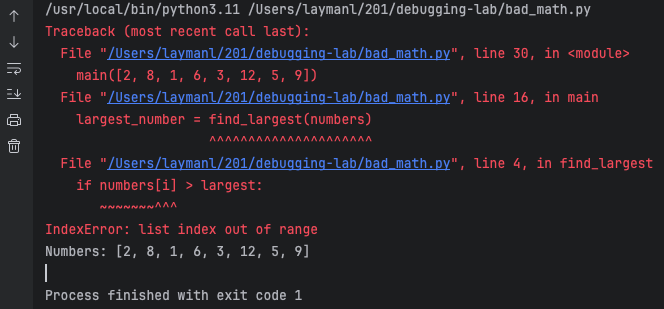

## Setup
1. Open your Terminal: 
    - Terminal app on Mac
    - PowerShell on Windows
1. Use the Terminal to create a directory called `debugging-lab/` in the same place you are gathering all your code for this class. 
1. Download [`bad_math.py`](bad_math.py) and save it to the `debugging-lab/` directory.
2. Open the `debugging-lab/` directory with PyCharm.
1. Select the `bad_math.py` file, then **Run it WITHOUT DEBUGGING**, either:
   - Right click in the editor and select `Run 'bad_math'`
   - Click the Play button next to `bad_math` in the toolbar
1. The program should crash with an error.

## What is debugging?
***Debugging*** is the process of understanding how a program arrived at a particular state. 

***Errors*** are incorrect calculations or bad states of a program. An error occurs while the program is *running*. Errors show as bad output, crashes, and the like. Debugging is often about comprehending how you arrived at an error. 

***Defects*** are programming mistakes, logic flaws, or problems with design that *could* lead to errors. What did you do wrong? 

*Defects* are problems or mistakes, *errors* are the tangible result of running a program with a defect.

Colloquially, we conflate these two terms into the concept of a "bugs", and hence the term "debugging"."Bug" is an old term pre-dating computers, but [Admiral Grace Hopper](https://en.wikipedia.org/wiki/Grace_Hopper), who is the main reason we no longer program in Assembly Language, popularized the term "bug" in computing after she found one in the Harvard Mark II computer:

## What is program *state*?
You have no doubt used `print()` statements to understand your program by printing variables, or printing `here` to see if a line executes is common. You are debugging using print statements. 

Think about what these `print` statements tell you. They tell you:
1. What are the variable values at a point in time?
2. Which lines of code are getting executed when?

These two pieces of information are the essence of debugging. Let's formalize them:
1. ***step***: the program statement (often a single line of code) that was just executed.
1. ***state*** of a program is comprised of:
   - the **variable values** at the step.
   - the **call stack** at the step. We will explain this in a moment.

Debugging is trying to understand how you arrived at a state. Sometimes that state is an error, sometimes you want to figure out how you get to a certain point.

## Debugging from an exception

Let's examine some debugging info assuming you follow the Setup at the top of the lab.

If the program crashes due to an exception, the ***stack trace*** will usually point you to the line of code that exploded:

There is a lot of useful information in this stack trace to start the debugging process.

It tells you that the error is in `bad_math.py, line 4` and even shows you the offending line of code.

<mark>**Don't fix any bugs yet. We want them for the next lab.**</mark>

The error is an `IndexError: list index out of range`. So the program tried to execute `numbers[i]` but likely `i` was too big.

The other lines show the ***call stack***, or the chain of function calls that are active in memory. In Python, the top-most function was called first, and the bottom-most function was called last (it is the reverse in Java):
  1. Line 30 of `<module>` called the `main()` function.
    - `<module>` represents the file `bad_math.py` itself and any code in the file that is *not* in a function or class.
  2. Inside `main()` on line 18, `largest_number = find_largest(numbers)` was called.
  3. Finally, inside `find_largest()`, the buggy line was called that generated the exception and crashed the program.

So the ***call stack*** is the chain of *active* functions that are waiting for something to be computed and returned. `<module> -> main() -> find_largest()`, which errored out. Look at the code itself to confirm the chain of function calls.

**Congratulations!** You have found some essential debugging information: the ***step*** at which the error occurred and the call stack portion of the ***state***. What key debugging information are you missing? 

The variable values! Now go to `line 4`. Add `print(i)` and `print(numbers)` right before that line to see what values `i` and `numbers` when the crash happens. That should give you a strong hint on what happened and how to fix it.

<mark>**Don't fix any bugs yet. We want them for the next lab.**</mark>

## Debugging is a process
**A good software engineer follows a structured process**. Use the exception message or your knowledge of the program to say, "Well, the problem could be this." Form a *hypothesis*. Then add `print` statements to help determine state around the problematic step.  Try different input values to confirm your hypothesis.

Maybe you will discover your hypothesis is incorrect. No problem! Maybe the error is actually due to something earlier in the call stack. Move your `print` statements up the stack and try again.

**Whatever you do, build and refine your hypotheses.** Do not just try something to see if it works. You may get lucky and fix the problem, but if you don't understand the fix, how do you really know? You will also be doomed to make the same mistake again if you don't understand what happened.

## A better way?
You can debug just fine with `print` statements, but managing them is tedious. You will also have times where it would be useful to *pause execution* of the program at a certain point say, on the first iteration of a loop. 

You can get state with `print` and control steps with code, but modern debugging tools will simplify this process while keeping your code clean.

We illustrate how to use PyCharm's debugger in [the next lab](../pycharm-debugger/).

## Knowledge check
- Question: What two elements comprise the ***state*** of a program at a particular ***step***?
- Question: Suppose you use a *constant* value that never changes in your program, like `pi = 3.14159`. Do you think the variable `pi` is part of the program state? Why or why not?
- Question: When do you see a *stack trace*? What information does it contain?
- Question: Explain the difference between an ***error*** and a ***defect***. Give an example of a defect and its resulting error.
- Question: What information about the running program is contained in the ***call stack***?