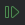
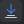
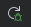

Debugging support tools have been around since the 70s. All modern IDEs let you control the ***steps*** of program execution while showing the  program ***state***. Debugging tools, properly used, are much more efficient than `print` statements.


## Running the debugger

If you didn't do it in the [Debugging Basics lab](../debugging-basics/), create a `debugging-lab/` directory and download [bad_math.py](../debugging-basics/bad_math.py) to it.

1. Open the `debugging-lab/` directory and open `bad_math.py` in an editor.
2. Run the program in debug mode by doing one of: 
   - Hit your `F5` key.
   - Right click in the code editor and select `Debug 'bad_math'`. 
   - Click the Bug button at the top of PyCharm.   
    


The PyCharm debugger should now launch. Notice that you are now in the Debugging pane of PyCharm, which is accessible anytime from the left sidebar. This pane will open any time you Run a program with debugging.


You should see something similar to the following:


The `bad_math.py` program should **crash** with an exception. Here are the essential elements you see:
1. The editor highlights the line where the program crashed. The red lightning bolt in the left indicates an exception was thrown. You can see the full exception text by clicking the "Console" tab. 
2. These are the **step controls**. PyCharm automatically paused on the step that caused the crash. More on the controls below.
3. The **variable pane** shows the values of all variables *in scope* at the current step. Variable values are one part of the program state.
5. The **call stack** is the other part of the program state. It shows the stack of function calls that arrived at the current step.


Using the **step controls**, hit either the green "play" icon or the red "stop" icon. Stop will cancel execution and produce nothing, play will continue execution of the program, resulting in the exception printing in the Terminal (where the program is running) and the program will crash. 

## Breakpoints and stepping
The PyCharm debugger will automatically ***break*** (pause) execution on steps that throw an exception. You can look at the **variable pane** and **call stack** to understand the state of the program and hopefully gain insight into what happened.

However, you will often want to **break** execution at step of your choosing, not just when an exception happens. Maybe want to see how a value was computed and what the variables were well before the crash happened. Or maybe your program doesn't crash at all, but simply produces the wrong output.

You add ***breakpoints*** in the IDE to tell the debugger on which step(s) to pause execution. To set a breakpoint:
1. **Set a breakpoint** by left-clicking on the line number in the code editor. A red dot will appear to indicate the breakpoint. Set a breakpoint on `line 3`.
   - Click the breakpoint again to remove it. 
   - You can set multiple break points. 
   - You cannot set a breakpoint on a blank line of code.
1. Launch the debugger by pressing `F5` or right-clicking and `Debug 'bad_math'`. 
2. The debugger will ***break*** (pause execution) on `line 3` or on whichever line you placed the breakpoint.
   
   Notice how PyCharm puts the current values of the variables `largest` and `numbers` in both the editor and the variable pane.
3. Use the **step controls** to control the execution of the program. All of these controls have a keyboard shortcut as well.
   -  - **Resume** execution until the next breakpoint or the program ends.
   -  - **Step Over** the current line, which means evaluate the line and go to the next one. 
   -  - **Step Into** the current line. If the current line *calls a function* like `if my_fun(x) == True`, the debugger will *step into* the `my_fun()` function and step through it. If you did *step over*, the debugger would evaluate the entire line including the `my_fun()` call without pausing.
   -  - **Step Into My Code**. The same as the previous *Step Into*, but only step into source code files in your project. Suppose you call `random.randint(0,10)` which is a function imported from a Python library. *Step Into* will take you to the implementation of `randint()`. *Step Into My Code* will skip it because you did not write that code. 
   -  - **Step Out** of the current function. This will immediately complete all lines of the current function and pause at the line that called the current function in the **call stack**.
   -  - **Restart** the debugging on the program. Just like re-running it. All your breakpoints will be retained.
   -  - **Stop** the debugger without further execution of the code.

Use the controls to **Step Over** a few lines. Notice that the **variable pane**, **watch pane**, and **call stack** update with each step. 

<video controls autoplay playsinline muted loop>
<source src="stepping-continuing.webm" type="video/webm">  
</video>

Using breakpoints and the step controls, you can precisely control the execution of the program to more methodically track down what is going on.

## Adding a watch variable
The **Threads & Variables pane** shows all variables *in scope* at each step. In bigger programs, the variable list can be huge and you won't care about most of them. To help, you can specify **watch variables** and **watch expressions** that always display at *the top* of the `Threads & Variables` pane. 

To set a **watch variable**: 
1. Set a breakpoint and start debugging the program
1. Select the variable in the editor *or* in the `threads & variables` 
2. Right Click and `Add to Watches`

<video controls autoplay playsinline muted loop>
<source src="add-to-watch.webm" type="video/webm">  
</video>


Now you will see your watched variables update as you step through the program. You can add as many watch variables as you like.

## Adding a watch expression
You can also watch a complete expression, such as a boolean comparison. This can be particularly useful for debugging `if-else` statements and loops. 

To set a **watch expression**:
1. Select the expression you want to evaluate in the editor.
   - The expression must be **valid**. So if you have the line `if numbers[i] > largest:`, select only the `numbers[i] > largest` portion of the statement.
1. Right click and `Add to Watches`.

<video controls autoplay playsinline muted loop>
<source src="watch-expr.webm" type="video/webm">  
</video>


## Conditional breakpoints
You will also find it useful to only have a breakpoint trigger under certain conditions. 

For example, you are reading file of 10,000 hospital patient records and you figure out that the program crashes when it gets to the record belonging to "Alice St. John". Unfortunately, Alice is record 342. You don't want to set a breakpoint on the offending line and have to hit the Continue control 341 times to figure out what's going on with Alice's data.

Enter the ***conditional breakpoint***, which is a breakpoint that only pauses execution when an expression you specify evaluates to `True`. Try it with our `bad_math.py` sample:
1. Set a regular breakpoint on line 3 and Debug the program. It stops on the first iteration.
1. Right click on the breakpoint on line3. A textbox will appear. Type `largest == 12` in the textbox.
   - **Note**: You can also add conditional breakpoints without creating a plain breakpoint first by right-clicking in the gutter.
3. Now hit the **Continue** control or restart the program in Debug mode. The conditional breakpoint will only pause when `largest == 12`.

Conditional breakpoints are extremely useful for refining your hypothesis as to what's going on. Note you can enter any Python expression that evaluates to `True` or `False`, for example:
   - `largest == 12 and i < 8`
   - `largest >= 5`


<video controls autoplay playsinline muted loop>
<source src="conditional-bp.webm" type="video/webm">  
</video>


## Starting with vs. without debugging
When running your program, you have the option to `Debug` or `Run`. What's the difference? 

*Run* will not pause on breakpoints or exception, nor will variable values be tracked. Your breakpoints and watch variables will remain in PyCharm, but they are not updated.

*Debug* will do everything we showed, but significantly slows down the execution time of your program. This is because to enable debugging your code must be *instrumented* to enable the debugger to control execution and evalute variable or expression values. Think of *instrumentation* as adding an `if breakpoint is True` before every line of code as well as a print statement. Running debug mode for a large, complex system, can be costly.


## Exercise
There are 4 bugs present in the initial `bad_math.py` that can be triggered based on which value the `numbers` variable has. The various calls to `main()` at the bottom of the file are sufficient to reveal all the bugs. 

Find and remove them. There are multiple ways to squash the bugs. You may squash two bugs at once depending on how you fix the first bug that causes the exception we have seen in our examples.

Your output should look like the following if you *gracefully* fix the bugs:
```bash
Numbers: [2, 8, 1, 6, 3, 12, 5, 9]
The largest number is: 12
The average is: 5.75
✅ All calculations are correct.
--------
Numbers: [32, 16, 8, 4, 2, 1, 0]
The largest number is: 32
The average is: 9.0
✅ All calculations are correct.
--------
Numbers: []
The list of numbers cannot be empty.
--------
Numbers: [2]
The largest number is: 2
The average is: 2.0
✅ All calculations are correct.
--------
Numbers: [12, 12]
The largest number is: 12
The average is: 12.0
✅ All calculations are correct.
--------
```


## Knowledge check
- Question: How do you run a program in debug mode in Pycharm?
- Question: How do you add a variable to the watch list from the editor view?
- Question: How do you set a conditional breakpoint that pauses when `x` evaluates to `False`?
- Question: What is the difference between `Step Over` and `Step Into` in terms of the next step of execution?


## Additional resources
- The official Debugging in [PyCharm documentation](https://www.jetbrains.com/help/pycharm/debugging-your-first-python-application.html#debug).
- Some [simple coding errors in Python](https://humanitiesprogramming.github.io/exercises/python-debugging/) you can practice with in the debugger.

## More practice
Move on to the [More Practice lab](../more-practice/) to continue working with the debugger.