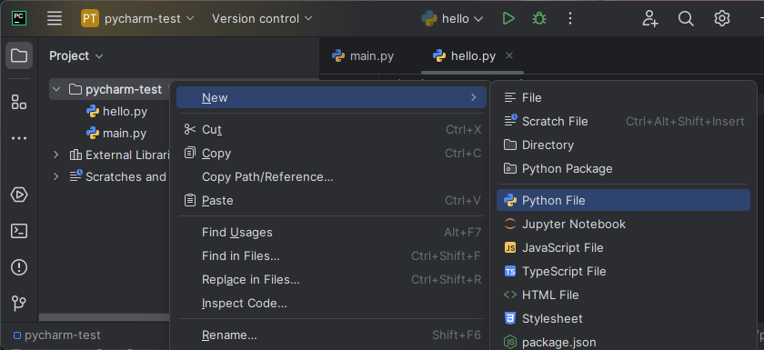

## Organizing and opening projects
The last thing we did in [Installing the PyCharm IDE](../../pycharm-install/) was to open the `pycharm-test` directory in PyCharm.

**Rule #1: Keep each project, assignment, and lab in its own directory.** This is the structure you want:

~/seng-201
├── assignment1
├── assignment2
├── lab01
├── lab02
└── pycharm-test
    ├── fib.py
    ├── hello.py
    └── hello2.py

- I have created a `seng-201/` subdirectory in my *home directory* symbolized by the `~`. The tilde (`~`) is understood by your Terminal to mean "the current user's home directory".
- Inside `seng-201/`, I have created subdirectories for each project. 

**Rule #2: Open the specific project directory in PyCharm, not the parent directory.** Suppose you want to work on `assignment1`, then you need to open the `assignment1/` directory. You open a folder in PyCharm in two ways:
1. Use your Terminal/CLI to `cd` into the project folder, then type (Windows) `pycharm64 .` or (Mac) `pycharm .`. Note that the `.` is important.
2. Open PyCharm first, then do `File → Open`. Select the project directory, then click `OK`.

The folder you open serves as the *working directory* for PyCharm. Do not open the parent directory, `seng-201/`, as it may create challenges running the Python code in the various subdirectories.

## Project pane
The Project pane is where you browse and manage files. Open it by clicking on the foldier icon in the left sidebar: 


Things you can do here include:
- Create new files and subdirectories.
- Double-click files to open.
- Right click files and directories for a variety of tools, like renaming and deleting. 

### Exercise
1. Click on the `pycharm-test` name. You created this folder when following the labs to install PyCharm.
2. Now right-click the directory name, then `New → Python File`. Give it a name like `foo.py`.
   
3. You will see an editor tab pop open on the right with the name `foo.py` at the top. 

## Knowledge check:
- Question: (True/False) Each coding project should have its own directory on the filesystem?
- Question: (True/False) It's okay to open the parent directory holding multiple projects in PyCharm?
- Question: What CLI command do you run to open PyCharm from the current directory?
