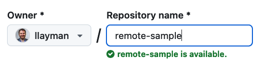

**Scenario**: You are on your computer. You make a new project and begin working. You decide you want to keep the project under version control with Git. 

## Create the local repo and save an initial version

1. Create a new directory called `remote-sample` in your `seng-201/` directory. 
2. Open the `remote-sample/` directory in Visual Studio Code.
3. Create a file named `test.py`. Put some code in there, like `print("We are going to share our new repository")`
4. Run `git init` to create a local repository.



5. Now stage and commit the changes.


You now have one version in the local repository, and the `main` branch (as well as the `HEAD`) are pointing to that version. I have left the INDEX and the HEAD out of the illustrations since we will not need them for this lab.

## Create a "blank" remote repo on GitHub
1. Browse to [https://github.com](https://github.com) and log in if necessary.
2. Find and click the green button to Create a New Repository:  
3. On the "Create a new repository" form, enter `remote-sample` for the **Repository name**: 
4. Leave all the rest of the options as-is. 
5. Click the green **Create repository** button at the bottom.

You will see a page that looks like this:


Make a note of the URL in your browser bar. Your repo can be accessed from this address.

Leave the browser window open. We will return to it in a minute.

**Public vs. Private Repos**: You have the choice to make your repo Public or Private when creating it, and you can change this setting later. 
- Public repos are visible on the Internet. Anyone can view the website and checkout your code. ***Only you can commit code however***.
- Private repos are only visible to you when signed in. Only you can checkout and commit to the repo.
You can control more finely if you want specific users to have read or write access to your repo through the Settings tab on the GitHub repo website.

## Connecting the local repo to the remote repo
We have created a local repo with `git init` and created a "bare" remote repo using the GitHub website, **but the two are not yet connected!**



On your GitHub page in the browser, you have a section that looks like the following:

**Copy that code for *your* repo** and paste it into the Terminal. Run those instructions in the Terminal.

You should see output similar to the following:
```bash
Enumerating objects: 3, done.
Counting objects: 100% (3/3), done.
Writing objects: 100% (3/3), 260 bytes | 260.00 KiB/s, done.
Total 3 (delta 0), reused 0 (delta 0), pack-reused 0
To https://github.com/llayman/remote-sample.git
 * [new branch]      main -> main
branch 'main' set up to track 'origin/main'.
```
That means you are good and your local repo is connected to the remote repo on GitHub.

**If you see an error like this**:
```bash
error: src refspec main does not match any
error: failed to push some refs to 'https://github.com/llayman/remote-sample.git'
```
You forgot to `git add` and `git commit` your first version.

## Viewing the remote repo
Refresh the GitHub page in your web browser. You should see something like this now:


This is GitHub's rendering of your remote repository! In Git, the remote repo looks just like the local repo on your computer. This is just how GitHub chooses to display it.

- You can click on `test.py` to see the code.
- Note that we are in the `main` branch as indicated in the top left dropdown.
- You can click on the commit version, e.g., `fb080da`, to see all the changes in the most recent commit.
- You can click on the history-clock icon  next to the version name to see the `main` branch's version history. There's only 1 version right now.

## Understanding the commands
You pasted three separate commands in the Terminal.

`git remote add` is what actually create a link between your local repo and the remote repository. Creating the remote repo link *does not* automatically share any version history or changes.



`git branch -M main` made sure the name of your default branch was `main` as opposed to `master`.

`git push` is what shared the version history from your local repo to the remote repo:


A few things happened to the repo state during this process.
1. Your local repo now has a notion of an "upstream" remote repo that it is linked to.
2. The version history of your local repo was `push`ed to the remote repo, including the branch name `main`. 
3. The remote repo on GitHub now has the entire version history of the `main` branch, and knows which version `main` refers to.

Again, the remote repo is *behaves exactly the same* as your local repo internally. It's just that it saved to a GitHub server, and you need to run an additional command, `git push` to share your changes with the remote repo.


## Knowledge Check
1. (Question) What is the purpose of running `git init`?
1. (Question) How do you connect a local Git repository to a remote repository?
1. (Question) Explain the function of `git remote add`.
2. (Challenge) Create a local repository and link it to a newly created GitHub remote repository.
3. (Challenge) Stage, commit, and push an initial version of a project to a remote repository, verifying success through the GitHub interface.